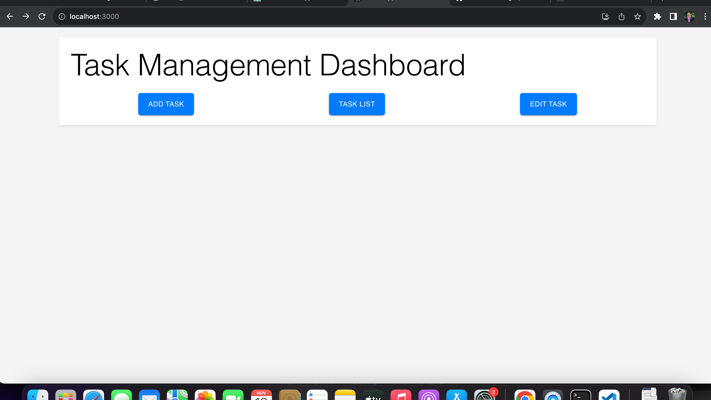
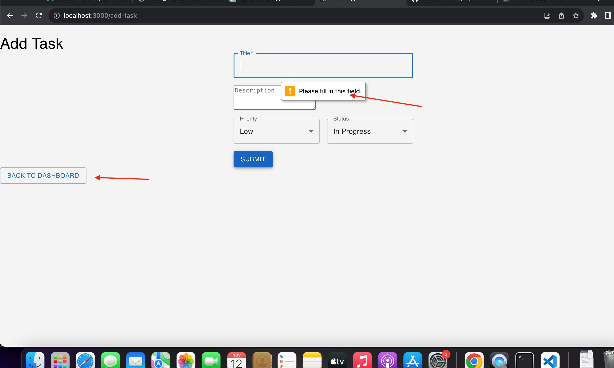
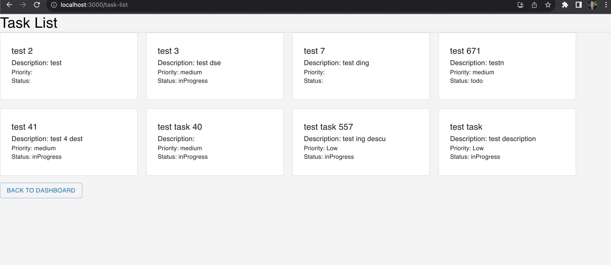
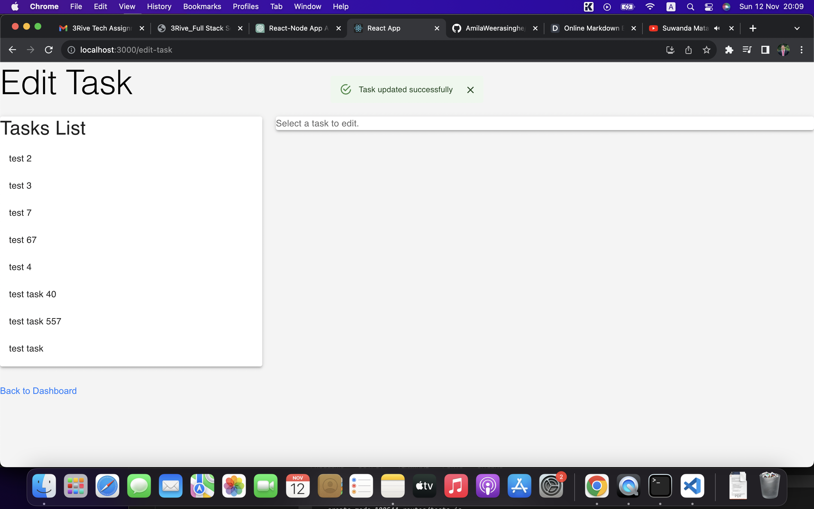
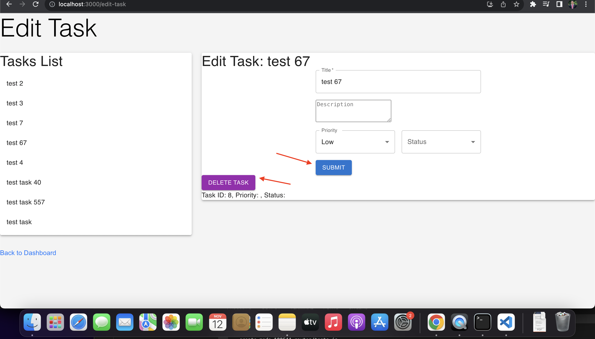

# How to run the app

1.clone the app
2.checkout the the root directory
3.`npm install`
4.`npm start`

Runs the app in the development mode.\
Open [http://localhost:3000](http://localhost:3000) to view it in your browser.
### Feature implements

##### Dashboard page
##### Seperate views Add view, View tasks ,Edit Tasks
##### Routing and navigation to views
##### Banners added for interactive user experince
##### Validations for fields
##### Add, view , update and delete the tasks
##### Seperate re-useble modules to Task list, Task Form, Edit tcs
##### seperate design files
##### material UI to facilitate UI components

### Features and Steps

1. First up page

2. Add Task page 
Contains Field validations and banners and navigations

3. View Tasks page
Card view of the available tasks list

4. Edit tasks page
Edit and delete options with necessary updated and banners
 

#### Improvement can be done in future

* If the application grows in complexity, consider using a state management library like Redux or React Context API
* Implement secure authentication and authorization mechanisms
* Sanitize and validate user inputs to prevent potential security vulnerabilities.

